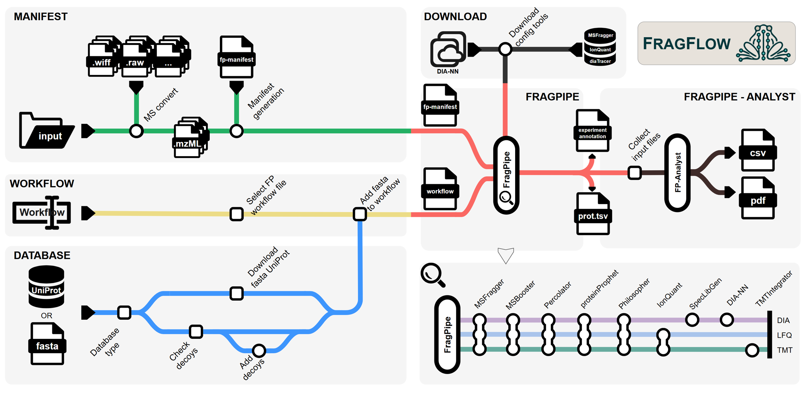

# FragFlow
**Automated Workflow for Large-Scale Quantitative Proteomics in High Performance Computing Environments**

### **Table of contents**
>[Introduction](#introduction)

>[Workflow](#workflow-and-overview)

>[Installation](#installation)
>> [Prerequisite: Nextflow](#prerequisite-nextflow)

>[Using FragFlow](#using-fragflow)
>> [1. Preparing input files](#1-preparing-input-files)\
>> [2. Configuration](#2-configuration)\
>> [3. Starting FragFlow](#3-running-fragflow)\
>> [4. Config Tools Download](#4-downloading-licensed-fragpipe-components-config-tools)\
>> [5. Notes on DIA-NN version](#5-notes-on-dia-nn-version)\
>> [6. Outputs](#6-outputs)

>[Parameters](#parameters)

>[Individual modules](#detailed-description-of-individual-modules)
>>[MSConverter](#msconverter)\
>>[FragPipe](#fragpipe)\
>>[FragPipe-Analyst](#fragpipe-analyst)

>[References](#references)

>[Authors](#authors)

### Introduction
 <div align="justify"> Here we introduce FragFlow an open-source pipeline that integrates FragPipe (FP) with Nextflow, a powerful workflow management system, to create a scalable, reproducible, and high-performance solution for proteomic data analysis. Nextflow enhances FP by automating workflows across HPC, cloud, and cluster environments, ensuring portability and reproducibility. Our integrated pipeline also streamlines downstream analyses, including differential expression, pathway mapping, and data visualization, while maintaining the ease of deploying across diverse computing infrastructures. This work represents a significant step forward in making the FP-based state-of-the-art proteomic data analysis more accessible and efficient for the broader research community.</div>

### Workflow and overview
<div align="justify"> This repository contains a Nextflow-based workflow for running FragPipe — a powerful toolkit for mass spectrometry data analysis (Figure 1). It supports all major data analysis modes available in FragPipe, while offering enhanced automation, and easy deployment.</div>

\
**Key Fetures**\
This workflow simplifies MS data analysis on Unix-based systems (HPC, cloud, etc.) by:
1. **Manifest generation:** Automatically creates a ```manifest``` FP input file based on the provided input folder.
2. **Raw file conversion:** Optionally converts raw MS files during processing with the MSConverter module (also available as a standalone step).
3. **Reference proteome management:**
    - Downloads reference proteome directly from UniProt, or
    - Utilizes a user-provided ```fasta``` file from path.
4. **Decoy sequence handling:** Augments collected reference proteome with decoy sequences when not already present.
5. **Workflow config:**
    - Selects the appropriate FP workflow
    - Integrates the reference proteome into the selected ```workflow``` file.
6. **Configuration tool download:**
    - Downloads required licensed config tools (MSFragger, IonQuant, diaTracer) after user information collection,
    - Downloads user-defined version of DIA-NN (optional)
    - Fully complies with FP's licensing terms.
7. **FragPipe Executions:** Runs the desired FP analysis workflow (also available standalone).
8. **FragPipe-Analyst Integration:** Optionally runs FP-Analyst for quick statistical DE result predictions (also available standalone).


**Figure 1. - Overview of the FragFlow pipeline.**
 <div align="justify">Overview of the FragFlow workflow, composed of six modular sub-workflows, each representing a key functionality in the automated proteomics analysis pipeline. FragFlow supports all major predefined FragPipe (FP) analysis modes as well as custom user-defined configurations. Manifest module generates the FP input manifest file from a specified directory, with optional raw file conversion. Database module downloads the appropriate reference proteome and appends decoy sequences for target-decoy analysis. Workflow module defines the FP analysis mode (e.g., LFQ, TMT, DIA) to be executed. Download module retrieves necessary licensed tools (e.g., MSFragger, IonQuant, diaTracer) in compliance with FP licensing agreements. FragPipe core module executes the main mass spectrometry analysis using the manifest and workflow configuration files. FragPipe-Analyst module performs downstream statistical analysis and visualization, generating plots such as PCA, volcano plots, and heatmaps.</div>

-----

## Installation
### Prerequisite: Nextflow
The only requirement is the installation of Nextflow, which can be easily performed using their self-installing package. All other requirements are already pre-packed into Docker containers. For detailed instructions, refer to the official <a href="https://www.nextflow.io/docs/latest/install.html" target="_blank">Nextflow Installation Guide</a>.
To install Nextflow simpy run:
``` 
curl -s https://get.nextflow.io | bash
```
Move nextflow into an executable folder and add to ```PATH```:
```
mkdir -p $HOME/.local/bin/
mv nextflow $HOME/.local/bin/

export PATH="$PATH:$HOME/.local/bin"
```
Then, verify the installation:
```
nextflow -version
```

## Using FragFlow
### 1. Preparing input files
By default ```.raw``` and ```.mzML``` mass spectrometry files are supported. Other file types may also be used - please refer to the [MSConverter sub-workflow](#msconverter) for compatibility details.\
**File naming convention:**
Input files should follow FragPipe's manifest generation guidelines. Please prepare the input files using the format: 
```
<filename>_<experiment>_<bioreplicate>_<mode>.raw
```
- filename - Original raw MS file name
- experiment - Group, experiment, or treatment identifier of the sample (can be text, number, or left empty)
- bioreplicate - Numerical identifier of a sample (can be number, or left empty)
- mode - Acquisition mode used in FragPipe (options: DDA, DDA+, DIA, DIA-Quant, DIA-lib or left empty)\
\
**Examples filenames:** 
- ```filename_control_1_DDA.mzML```
- ```filename_KO_3.raw```
- ```filename_treatment_DIA.raw```
- ```file_name_control.mzML```

Ensure that your input files are named correctly to prevent processing errors.

### 2. Configuration
Input parameters can be defined in multiple ways:
- **A. Modifying the ```nextflow.config``` file**
    - Recommended only when pulling this repository.
    - Allows setting default configurations for the workflow.
    - Example configuration is ```nextflow.config.example```, copy it to ```nextflow.config``` before editing:
```
cp nextflow.config.example nextflow.config
```
- **B. Using custom config file (```<your_file>.<yml/json>```)**
    - Definie parameters in ```YAML``` or ```JSON``` format.
    - Specify the config file when running Nextflow:
    - Refer to Nextflow's documentation on <a href="https://www.nextflow.io/docs/latest/cli.html#pipeline-parameters" target="_blank">parameter files</a>
```
nextflow run ronalabrcns/FragFlow -params-file my_parameters.yml
```
- **C. Defining parameters in the command line**
    - Recommended for quick and flexible excecution
    - Example command:
```
nextflow run ronalabrcns/FragFlow \
    --input_folder "/path/to/input/folder" \
    --ram 32 \
    --threads 16 \
    --workflow "LFQ-MBR" \
    --mode "DDA" \
    --fasta_file "UP000005640"
```
**For further details please check Nextflow's documentation on the [hierarchy of parameter settings](https://www.nextflow.io/docs/latest/config.html).\
\
**Mandatory parameters:**
To successfully execute FragFlow, the following parameters must be specified:
- ```--input_folder``` - Path to the input folder
- ```--workflow``` - Selected FP workflow
- ```--mode``` - Aqcuisition mode
- ```--fasta_file```. Reference proteome *fasta* file

For more details on parameters please see the [Parameters](#parameters) section.

### 3. Running FragFlow
When runnning FragFlow, all output files will be generated into the current working directory. If executing multiple analysis, **ensure that you are in the correct directory before starting the workflow!**\
\
**Basic execution**
``` 
nextflow run ronalabrcns/FragFlow
```
**Running as a background process**\
For long-runnning analysis, it is recommended to start FragFlow as a background process. This allows uninterrupted execution even if the terminal session is closed (similar to *nohup*). To do so, use the ```-bg``` option and redircet the ouptut to a log file:
```
nextflow run ronalabrcns/FragFlow -bg > fragflow.log
```
This ensures that the process continues running while logs are stored in fragflow.log for monitoring.

To cancel FragFlow, first identify the process pid using ```ps``` or alternatively check the ```.nextflow.pid``` to ```kill``` the process. More information on <a href="https://www.nextflow.io/docs/latest/cli.html#execution-as-a-background-job" target="_blank">background execution</a>.

### 4. Downloading licensed FragPipe components (config tools)
<div align="justify">To enable a user-friendly execution of the workflow, the download process for essential configuration tools — namely MSFragger, diaTracer, and IonQuant — has been fully automated. During the initial analysis, all required tools will be downloaded into the project directory to keep everything organized and transparent. Before proceeding with the download, users are asked to provide their name, institution, and email address. In addition, users must read and accept the licensing terms for <a href="https://msfragger-upgrader.nesvilab.org/upgrader/MSFragger-LICENSE.pdf">MSFragger</a>, <a href="https://msfragger.arsci.com/ionquant/IonQuant Academic Use License 05162022.pdf">IonQuant</a>, and <a href="https://msfragger-upgrader.nesvilab.org/diatracer/diaTracer UM %23 2024-417 Academic Research Use License 05142024.pdf">diaTracer</a>. If the necessary information is not provided, or if the licensing terms are not explicitly accepted, the download process will be halted. This procedure ensures that all licensing directives are strictly respected and maintained throughout the workflow. <b>We kindly ask all users to carefully read and honor the licensing agreements</b> to support the continued development of these essential tools.</div>

### 5. Notes on DIA-NN version
Currently FragPipe supports DIA-NN version 1.8.2beta. With FragFlow, users can add custom versions of DIA-NN to use. See latest release at: <a href="https://github.com/vdemichev/DiaNN/releases/latest" target="_blank"> *DIA-NN: latest* </a>
Define the download link to the *Linux* version of any DIA-NN release using the ```--diann_download``` parameter.\
*Note: currently when using MSBooster, the newer versions of DIA-NN does not run successfully. For this reason, when specifying newer version of DIA-NN (1.8.2+), the newer version will only be used during the DIA-NN analysis. Additionally, current changes in newer DIA-NN modules, can raise errors in FP, which can be eventually handled by FP developers in future releases. This does not effect the results generated by FragFlow.*

### 6. Outputs
TODO: describe the output formats, the log files for each and every process in the work/XX/hexa/nextflow.log file!...
<details>
 <summary>Data folder</summary>
 <br>
 - manifest
 - database
 - workflow
</details>

<details>
 <summary>Output folder</summary>
 <br>
 - MSconverter
 - FragPipe
 - FragPipeAnalyst
</details>
-----

## Parameters
Parameters are accesible through the *nextflow.config* file. Additionally, every parameter can be added during execution e.g. *--input_folder*.
**Mandatory parameters:**
|Parameters|Types|Description|
|-----------------|-----|-----------|
|```--input_folder```|*string*|Folder containing the input files with the specified name conventions LINK|
|```--mode```|*string*|Data aqcuisition mode (DDA, DIA, TMT)|
|```--workflow```|*string*|Name of one of the pre-defined <a href="https://fragpipe.nesvilab.org/docs/tutorial_fragpipe_workflows.html" target="_blank"> workflow available in FragPipe</a>|
|```--fasta_file```|*string*|Path to fasta_file location OR UniProt ID of reference proteome.|

**MSConverter parameters:**
Parameter|Types|Description|
|---------|-----|-----------|
|```--raw_file_type```|*string*|Extension of raw files used. *Default: .raw*|
|```--batch_size```|*integer*|Number of files handled by MSConverter in one job. Use this parameter to set the number of jobs started for raw file conversion. E.g. Batches of 10 for 100 files will start 10 parallel jobs.|

**Optional FragPipe parameters:**
|Parameter|Types|Description|
|---------|-----|-----------|
|```--decoy_tag```|*string*|The tag identifier used in the fasta file for decoy sequences. Default: *'rev_'*|
|```--db_split```|*integer*|DB split ...|
|```--ram```|*integer*|Memory allocation for FragPipe [GB]|
|```--threads```|*integer*|Number of threads defined for FragPiipe|

**Sub-workflow switch parameters:**
|Parameter|Types|Description|
|---------|-----|-----------|
|```--disable_msconvert```|*boolean*|Turn on-off the sub-workflow MSConverter|
|```--disable_fragpipe```|*boolean*|Turn on-off the sub-workflow FragPipe|
|```--disable_fp_analyst```|*boolean*|Turn on-off the sub-workflow FragPipe-Analyst|

**Config tools parameters:**
|Parameter|Types|Description|
|---------|-----|-----------|
|```--config_tools_update```|*boolean*|Force download of all config tools.|
|```--diann_download```|*string*|Url link to DIA-NN release (If blank ```''```, then built-in DIA-NN will be used)|

**FragPipe-Analyst parameters:**
|Parameter|Types|Description|
|---------|-----|-----------|
|```--experiment```|*string*|Path to ```experiment_annotation.tsv``` file used by FragPipe-Analyst.|
|```--p_table```|*string*|Path to prtoein/peptide table used by FragPipe-Analyst.|
|```--analyst_mode```|*string*|Analysis mode of FragPipe-Analyst. Available modes: "protein" OR "peptide".|
|```--gene_list```|*string list*|List of strings containing gene/protein names, used for the boxplot generation for comparisions.|
|```--plot_mode```|*string*|Vizualization mode used in FragPipe-Analyst, for the volcano plots and comparative boxplots. Available modes: "gene" OR "protein"|
|```--gene_set_database```|*string*| Select from two possibilities of databases for GSEA: ["Hallmark", "KEGG"]|

-----

## Detailed description of individual modules
### MSConverter
adas
### FragPipe
run only fragpipe

### FragPipe-Analyst
run only fragpipe anal

## References
- FragPipe [[1](https://fragpipe.nesvilab.org/)]
- FragPipe-Analyst [[2](https://fragpipe-analyst-doc.nesvilab.org/), [3](https://pubs.acs.org/doi/10.1021/acs.jproteome.4c00294)]
- MSFragger [[4](https://www.nature.com/articles/nmeth.4256)], Ionquant [[5](https://www.mcponline.org/article/S1535-9476(21)00050-5/fulltext)], diaTracer[[6](https://www.nature.com/articles/s41467-024-55448-8)]
- DIA-NN[[7](https://www.nature.com/articles/s41592-019-0638-x)]

1. FragPipe Homepage
2. FragPipe-Analyst Documentation
3. Hsiao, Y., Zhang, H., Li, G. X., Deng, Y., Yu, F., Valipour Kahrood, H., Steele, J. R., Schittenhelm, R. B., & Nesvizhskii, A. I. (2024). Analysis and Visualization of Quantitative Proteomics Data Using FragPipe-Analyst. Journal of Proteome Research, 23(10), 4303–4315. https://doi.org/10.1021/acs.jproteome.4c00294
4. Kong, A., Leprevost, F., Avtonomov, D. et al. MSFragger: ultrafast and comprehensive peptide identification in mass spectrometry–based proteomics. Nat Methods 14, 513–520 (2017). https://doi.org/10.1038/nmeth.4256
5. Yu, F., Haynes, S. E., & Nesvizhskii, A. I. (2021). IonQuant Enables Accurate and Sensitive Label-Free Quantification With FDR-Controlled Match-Between-Runs. Molecular & Cellular Proteomics, 20. https://doi.org/10.1016/j.mcpro.2021.100077
6. Li, K., Teo, G.C., Yang, K.L. et al. diaTracer enables spectrum-centric analysis of diaPASEF proteomics data. Nat Commun 16, 95 (2025). https://doi.org/10.1038/s41467-024-55448-8
7. Demichev, V., Messner, C.B., Vernardis, S.I. et al. DIA-NN: neural networks and interference correction enable deep proteome coverage in high throughput. Nat Methods 17, 41–44 (2020). https://doi.org/10.1038/s41592-019-0638-x

## Authors
<ins>Istvan Szepesi-Nagy</ins>(1,6), Roberta Borosta(1,7), Zoltan Szabo(2), Gabor Tusnady(3), Lorinc Pongor(4), Gergely Rona(1,5)

1. DNA Repair Research Group, Institute of Molecular Life Sciences, HUN-REN Research Centre for Natural Sciences, Budapest, HU
2. Department of Medical Chemistry, Albert Szent-Györgyi Medical School, University of Szeged, Szeged, HU
3. Proteomics Bioinformatics Research Group, Institute of Molecular Life Sciences, HUN-REN Research Centre for Natural Sciences, Budapest, HU
4. Cancer Genomics and Epigenetics Core Group, Hungarian Centre of Excellence for Molecular Medicine (HCEMM), Szeged, HU
5. Department of Biochemistry and Molecular Pharmacology, NYU Grossman School of Medicine, NY, USA
6. Semmelweis University Doctoral School, Budapest, HU
7. Doctoral School of Biology, ELTE Eötvös Loránd University, Budapest, HU
