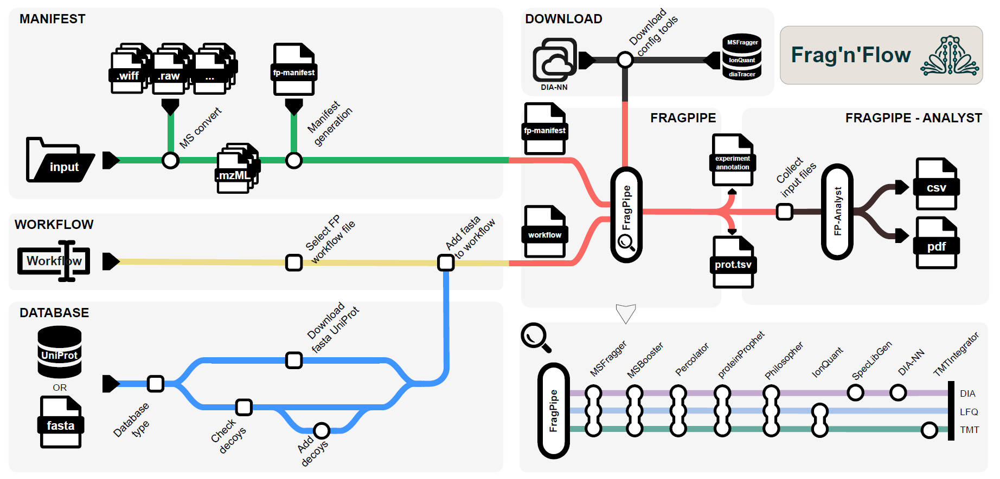

[](https://doi.org/10.5281/zenodo.16600724)
# Frag'n'Flow
**Automated Workflow for Large-Scale Quantitative Proteomics in High Performance Computing Environments**

### **Table of contents**
>[Introduction](#introduction)

>[Workflow](#workflow-and-overview)

>[Installation](#installation)
>> [Prerequisite: Nextflow](#prerequisite-nextflow)

>[Using Frag'n'Flow](#using-fragnflow)
>> [1. Preparing input files](#1-preparing-input-files)\
>> [2. Configuration](#2-configuration)\
>> [3. Starting Frag'n'Flow](#3-running-fragnflow)\
>> [4. Config Tools Download](#4-downloading-licensed-fragpipe-components-config-tools)\
>> [5. Notes on DIA-NN version](#5-notes-on-dia-nn-version)\
>> [6. Outputs](#6-outputs)

>[Parameters](#parameters)

>[Individual modules](#detailed-description-of-individual-modules)
>>[MSConverter](#msconverter)\
>>[FragPipe](#fragpipe)\
>>[FragPipe-Analyst](#fragpipe-analyst)

>[References](#references)

>[Authors](#authors)

### Introduction
 <div align="justify"> Here we introduce Frag'n'Flow an open-source pipeline that integrates FragPipe (FP) with Nextflow, a powerful workflow management system, to create a scalable, reproducible, and high-performance solution for proteomic data analysis. Nextflow enhances FP by automating workflows across HPC, cloud, and cluster environments, ensuring portability and reproducibility. Our integrated pipeline also streamlines downstream analyses, including differential expression, pathway mapping, and data visualization, while maintaining the ease of deploying across diverse computing infrastructures. This work represents a significant step forward in making the FP-based state-of-the-art proteomic data analysis more accessible and efficient for the broader research community.</div>

### Workflow and overview
<div align="justify"> This repository contains a Nextflow-based workflow for running FragPipe — a powerful toolkit for mass spectrometry data analysis (Figure 1). It supports all major data analysis modes available in FragPipe, while offering enhanced automation, and easy deployment.</div>

\
**Key Fetures**\
This workflow simplifies MS data analysis on Unix-based systems (HPC, cloud, etc.) by:
1. **Manifest generation:** Automatically creates a ```manifest``` FP input file based on the provided input folder.
2. **Raw file conversion:** Optionally converts raw MS files during processing with the MSConverter module (also available as a standalone step).
3. **Reference proteome management:**
    - Downloads reference proteome directly from UniProt, or
    - Utilizes a user-provided ```fasta``` file from path.
4. **Decoy sequence handling:** Augments collected reference proteome with decoy sequences when not already present.
5. **Workflow config:**
    - Selects the appropriate [FP workflow](https://fragpipe.nesvilab.org/docs/tutorial_fragpipe_workflows.html), and
    - Integrates the reference proteome into the selected ```workflow``` file.
6. **Configuration tool download:**
    - Downloads required licensed config tools (MSFragger, IonQuant, diaTracer) after user information collection,
    - Downloads user-defined version of DIA-NN (optional)
    - Fully complies with FP's licensing terms.
7. **FragPipe Executions:** Runs the desired FP analysis workflow (also available standalone).
8. **FragPipe-Analyst Integration:** Optionally runs FP-Analyst for quick statistical DE result predictions (also available standalone).


**Figure 1. - Overview of the Frag'n'Flow pipeline.**
 <div align="justify">Overview of the Frag'n'Flow workflow, composed of six modular sub-workflows, each representing a key functionality in the automated proteomics analysis pipeline. Frag'n'Flow supports all major predefined FragPipe (FP) analysis modes as well as custom user-defined configurations. Manifest module generates the FP input manifest file from a specified directory, with optional raw file conversion. Database module downloads the appropriate reference proteome and appends decoy sequences for target-decoy analysis. Workflow module defines the FP analysis mode (e.g., LFQ, TMT, DIA) to be executed. Download module retrieves necessary licensed tools (e.g., MSFragger, IonQuant, diaTracer) in compliance with FP licensing agreements. FragPipe core module executes the main mass spectrometry analysis using the manifest and workflow configuration files. FragPipe-Analyst module performs downstream statistical analysis and visualization, generating plots such as PCA, volcano plots, and heatmaps.</div>

-----
## Before you begin
> We highly recommend thoroughly reading the following detailed and well-written documentations on [FragPipe](https://fragpipe.nesvilab.org/docs/tutorial_fragpipe.html) and [Nextflow](https://www.nextflow.io/docs/latest/index.html).

## Installation
### Prerequisite: Nextflow
The only requirement is the installation of Nextflow, which can be easily performed using their self-installing package. All other requirements are already pre-packed into Docker containers. For detailed instructions, refer to the official <a href="https://www.nextflow.io/docs/latest/install.html" target="_blank">Nextflow Installation Guide</a>.
To install Nextflow simpy run:
``` 
curl -s https://get.nextflow.io | bash
```
Move nextflow into an executable folder and add to ```PATH```:
```
mkdir -p $HOME/.local/bin/
mv nextflow $HOME/.local/bin/

export PATH="$PATH:$HOME/.local/bin"
```
Then, verify the installation:
```
nextflow -version
```

## Using Frag'n'Flow
### 1. Preparing input files
By default ```.raw``` and ```.mzML``` mass spectrometry files are supported. Other file types may also be used - please refer to the [MSConverter sub-workflow](#msconverter) for compatibility details.\
**File naming convention:**
Input files should follow FragPipe's manifest generation guidelines. Please prepare the input files using the format: 
```
<filename>_<experiment>_<bioreplicate>_<mode>.raw
```
- filename - Original raw MS file name
- experiment - Group, experiment, or treatment identifier of the sample (can be text, number, or left empty)
- bioreplicate - Numerical identifier of a sample (can be number, or left empty)
- mode - Acquisition mode used in FragPipe (options: DDA, DDA+, DIA, DIA-Quant, DIA-lib or left empty)\
\
**Examples filenames:** 
- ```filename_control_1_DDA.mzML```
- ```filename_KO_3.raw```
- ```filename_treatment_DIA.raw```
- ```file_name_control.mzML```

Ensure that your input files are named correctly to prevent processing errors.

### 2. Configuration
Input parameters can be defined in multiple ways:
- **A. Modifying the ```nextflow.config``` file**
    - Recommended only when pulling this repository.
    - Allows setting default configurations for the workflow locally.
    - Example configuration is ```nextflow.config```,  modify parameters according to [Parameters](#parameters):
> *Note: By default Nextflow needs a ```nextflow.config``` file present in the project directory, if changing this do not rename otherwise parameters not initialized.*

- **B. Using custom config file (```<your_file>.config```)**
    - Definie parameters and global options in a custom config format.
    - Specify the config file when running Nextflow:
    - Ideal to launch Frag'n'Flow from link.
    - Refer to Nextflow's documentation on <a href="https://www.nextflow.io/docs/latest/config.html" target="_blank">configuration files</a>
```
nextflow run ronalabrcns/FragNFlow -c custom_config_example.config
```
> *Note: Custom config files are ideal for parameter file definitions and also for global process settings, see example below.*
```
params.input_folder = 'my/path/to/input/folder'
params.workflow = 'LFQ-MBR'
params.mode = 'DDA'
params.fasta_file = 'path/to/fasta/file.fasta'
```
- **C. Defining parameters in the command line**
    - Recommended for quick and flexible excecution
    - Example command:
```
nextflow run ronalabrcns/FragNFlow \
    --input_folder "/path/to/input/folder" \
    --ram 32 \
    --threads 16 \
    --workflow "LFQ-MBR" \
    --mode "DDA" \
    --fasta_file "UP000005640"
```
> For further details please check Nextflow's documentation on the [hierarchy of parameter settings](https://www.nextflow.io/docs/latest/config.html).


**Mandatory parameters:**
To successfully execute Frag'n'Flow, the following parameters must be specified:
- ```--input_folder``` - Path to the input folder
- ```--workflow``` - Selected FP workflow
- ```--mode``` - Aqcuisition mode
- ```--fasta_file```. Reference proteome *fasta* file

For more details on parameters please see the [Parameters](#parameters) section.

### 3. Running Frag'n'Flow
When runnning Frag'n'Flow, all output files will be generated into the current working directory. If executing multiple analysis, **ensure that you are in the correct directory before starting the workflow!**\
\
**Basic execution**
``` 
nextflow run ronalabrcns/FragNFlow
```
\
**Defining Executors for Frag'n'Flow**\
In Nextflow, **executors** are the components that determine the system where a process is run and supervises the execution. Such executors include AWS, Azure Batch, SLURM etc. Please refer to Nextflow's documentation on [available executors](https://www.nextflow.io/docs/latest/executor.html).\
To define SLURM options in Frag'n'Flow please define options in the ```nextflow.config``` or the custom ```example.config``` files. The ```clusterOptions``` is used to define additional available [```sbatch``` options](https://slurm.schedmd.com/sbatch.html) to the process.
```
process{
    withName:FRAGPIPE{
        executor = 'slurm'
        memory = 32.GB
        cpus = 16
        time = '5h'
        clusterOptions = '--account="myuser"'
    }
}
```
\
**Running as a background process**\
For long-runnning analysis, it is recommended to start Frag'n'Flow as a background process. This allows uninterrupted execution even if the terminal session is closed (similar to *nohup*). To do so, use the ```-bg``` option and redircet the ouptut to a log file:
```
nextflow run ronalabrcns/FragNFlow -bg > fragnflow.log
```
This ensures that the process continues running while logs are stored in fragnflow.log for monitoring.

To cancel Frag'n'Flow, first identify the process pid using ```ps``` or alternatively check the ```.nextflow.pid``` to ```kill``` the process. More information on <a href="https://www.nextflow.io/docs/latest/cli.html#execution-as-a-background-job" target="_blank">background execution</a>.

### 4. Downloading licensed FragPipe components (config tools)
<div align="justify">To enable a user-friendly execution of the workflow, the download process for essential configuration tools — namely MSFragger, diaTracer, and IonQuant — has been fully automated. During the initial run, please download all required tools will be downloaded into the project directory to keep everything organized and transparent. </div>

>Set the parameter ```--config_tools``` to ```true``` on the very first run to start config tools download.

<div align="justify">Before proceeding with the download, users are asked to provide their name, institution, and email address. Only academic email adresses are accepted where the user gets a verification token. Use this token then to start the downloads. In addition, users must read and accept the licensing terms for <a href="https://msfragger-upgrader.nesvilab.org/upgrader/MSFragger-LICENSE.pdf">MSFragger</a>, <a href="https://msfragger.arsci.com/ionquant/IonQuant Academic Use License 05162022.pdf">IonQuant</a>, and <a href="https://msfragger-upgrader.nesvilab.org/diatracer/diaTracer UM %23 2024-417 Academic Research Use License 05142024.pdf">diaTracer</a>. If the necessary information is not provided, or if the licensing terms are not explicitly accepted, the download process will be halted. This procedure ensures that all licensing directives are strictly respected and maintained throughout the workflow. <b>We kindly ask all users to carefully read and honor the licensing agreements</b> to support the continued development of these essential tools.</div>

### 5. Notes on DIA-NN version
Currently FragPipe supports DIA-NN version 1.8.2beta. With Frag'n'Flow, users can add custom versions of DIA-NN to use. See latest release at: <a href="https://github.com/vdemichev/DiaNN/releases/latest" target="_blank"> *DIA-NN: latest* </a>
Define the download link to the *Linux* version of any DIA-NN release using the ```--diann_download``` parameter.\
*Note: currently when using MSBooster, the newer versions of DIA-NN does not run successfully. For this reason, when specifying newer version of DIA-NN (1.8.2+), the newer version will only be used during the DIA-NN analysis. Additionally, current changes in newer DIA-NN modules, can raise errors in FP, which can be eventually handled by FP developers in future releases. This does not effect the results generated by Frag'n'Flow.*

### 6. Outputs
All processes produce detailed log files, stored in the  ```work/XX/HEX/nextflow.log``` path, and generate structured outputs organized under the <b>Data</b> and <b>Output</b> folders. The Data folder includes files like the generated manifest, reference proteome database, and selected workflow configuration, while the Output folder contains converted mzML files, FragPipe results, and FP-Analyst reports in TSV, CSV, and PDF formats.

<details>
 <summary>Data folder</summary>
 <br>
 <details>
   <summary>manifest</summary>
   <be> <b>generated_manifest.fp-manifest</b> - Generated manifest file containing input file paths, experiment group and bioreplicate identifiers and aqcuisition mode. 
  </details>
<details>
   <summary>database</summary>
   <be> <b>reference_proteome_decoy.fasta</b> - Reference proteome FASTA file containing decoy sequences. 
</details>
 <details>
   <summary>workflow</summary>
   <be> <b>selected_workflow_db.workflow</b> - User selected FragPipe workflow file with reference proteome fasta file path. 
</details>
</details>


<details>
 <summary>Output folder</summary>
 <br>
      <details>
               <summary>msconverter</summary>
               <be> <b>your_input_file.mzML</b> - Converter mzML files. Upon conversion, this folder's files listed in the manifest file.
    </details>
    <details>
           <summary>fragpipe</summary>
            <be> <b>output_folder_fragpipe</b> - Output folder containing the standard FP output files of the given workflow.
    </details>
    <details>
   <summary>fp_analyst</summary>
    <b>experiment_annotation.tsv</b> - Experiment annotation file copied from FP output folder, used for FP-Analyst input.
    <br><b>p_table.tsv</b> - Protein or peptide table copied from FP output folder, used for FP-Analyst input.
    <br><b>output.csv</b> - Comma-separated value file containing FP-Analyst outputs.
    <br><b>output.pdf</b> - PDF report containing plots and figures to visually represent quality check and DE results.
 </details>   
</details>
</details>

---

## Parameters
Parameters are accesible through the *nextflow.config* file. Additionally, every parameter can be added during execution e.g. *--input_folder*.

**Licensed config tools download:**
|Parameter|Types|Description|
|---------|-----|-----------|
|```--config_tools```|*boolean*|Allow (true) the download of licensed config tools (MSFragger, IonQuant, diaTracer)|

**Sub-workflow switch parameters:**
|Parameter|Types|Description|
|---------|-----|-----------|
|```--disable_msconvert```|*boolean*|Turn on-off the sub-workflow MSConverter|
|```--disable_fragpipe```|*boolean*|Turn on-off the sub-workflow FragPipe|
|```--disable_fp_analyst```|*boolean*|Turn on-off the sub-workflow FragPipe-Analyst|

**Mandatory parameters:**
|Parameters|Types|Description|
|-----------------|-----|-----------|
|```--input_folder```|*string*|Folder containing the input files with the specified name conventions LINK|
|```--mode```|*string*|Data aqcuisition mode (DDA, DIA, TMT)|
|```--workflow```|*string*|Name of one of the pre-defined <a href="https://fragpipe.nesvilab.org/docs/tutorial_fragpipe_workflows.html" target="_blank"> workflow available in FragPipe</a>. Optionally, a custom worfklow file can be specified with file path and *.workflow* extension.|
|```--fasta_file```|*string*|Path to fasta_file location OR UniProt ID of reference proteome.|

**MSConverter parameters:**
Parameter|Types|Description|
|---------|-----|-----------|
|```--raw_file_type```|*string*|Extension of raw files used. *Default: .raw*|
|```--batch_size```|*integer*|Number of files handled by MSConverter in one job. Use this parameter to set the number of jobs started for raw file conversion. E.g. Batches of 10 for 100 files will start 10 parallel jobs.|

**Optional FragPipe parameters:**
|Parameter|Types|Description|
|---------|-----|-----------|
|```--decoy_tag```|*string*|The tag identifier used in the fasta file for decoy sequences. Default: *'rev_'*|
|```--db_split```|*integer*|DB split ...|
|```--ram```|*integer*|Memory allocation for FragPipe [GB]|
|```--threads```|*integer*|Number of threads defined for FragPipe|
|```--use_custom_manifest```|*boolean*|There is an option to set custom defined manifest file. !```IMPORTANT```! The input folder path must be specified among the mandatory parameters due to container mounting reasons!|
|```--custom_manifest```|*string*|Absolute path to custom manifest file.|


**Newer version of DIA-NN:**
|Parameter|Types|Description|
|---------|-----|-----------|
|```--diann_download```|*string*|Url link to [DIA-NN release](https://github.com/vdemichev/DiaNN/releases/latest) (If blank ```''```, then built-in DIA-NN will be used)|

**FragPipe-Analyst parameters:**
|Parameter|Types|Description|
|---------|-----|-----------|
|```--experiment```|*string*|Path to ```experiment_annotation.tsv``` file used by FragPipe-Analyst.|
|```--p_table```|*string*|Path to prtoein/peptide table used by FragPipe-Analyst.|
|```--analyst_mode```|*string*|Analysis mode of FragPipe-Analyst. Available modes: "protein" OR "peptide".|
|```--gene_list```|*string list*|List of strings containing gene/protein names, used for the boxplot generation for comparisions.|
|```--plot_mode```|*string*|Vizualization mode used in FragPipe-Analyst, for the volcano plots and comparative boxplots. Available modes: "gene" OR "protein"|
|```--gene_set_database```|*string*| Select from two possibilities of databases for GSEA: ["Hallmark", "KEGG"]|

-----

## Detailed description of individual modules
Three modules can be run independently in standalone mode: MSConverter, FragPipe, and FP-Analyst. Each module can be enabled or disabled using parameters described above.\
Below is a detailed description of each module:
### MSConverter
The MSConverter module handles raw mass spectrometry (MS) file conversion. We provide an MSConverter Docker container for in-place data conversion, optimized for FragPipe compatibility. Supported input formats include ```.raw``` and ```.wiff``` files, and batch conversion of multiple files is supported. Converted ```.mzML``` files are saved into the ```output/msconverter/``` folder. When FragPipe is enabled, it uses this converted data, and the input path is automatically adjusted.\
>For more details on file conversion, refer to the [FragPipe documentation](https://fragpipe.nesvilab.org/docs/tutorial_convert.html).

### FragPipe
The FragPipe module executes the main analysis pipeline. Only two mandatory input files are required: a manifest and a workflow. FragPipe runs the analysis and outputs results into the output/fragpipe/ folder. We support fully customized analyses by allowing users to supply their own manifest and workflow files.\
>If you're new to Frag'n'Flow, we strongly encourage checking out FragPipe’s [tutorials](https://fragpipe.nesvilab.org/docs/tutorial_fragpipe.html) and detailed explanations of its [workflow](https://fragpipe.nesvilab.org/docs/tutorial_fragpipe_workflows.html) modes.

When FP-Analyst is enabled, key output files (e.g., experiment annotation and protein/peptide TSV files) are automatically copied to the input location for FP-Analyst.

### FragPipe-Analyst
Frag'n'Flow also support the standalone execution of FragPipe-Analyst, for quick, on cluster execution of quality measurements and differential expression analysis. This way a quick first impulse can be seen by the data. However for more in depth analysis and lighter user experience the FragPipe-Analyst Shiny web app is highly recommended and appreciated. Our FP-Analyst module outputs a resulting csv file with all DE analysis results and a PDF file report with all the necessary plots and figures. 

FP-Analyst can also be executed independently for fast, on-cluster quality assessment and differential expression analysis. This provides a quick initial overview of the data on the spot.\
The FP-Analyst module produces:
* A CSV file containing all differential expression (DE) results.
* A PDF report with all relevant plots and figures.

>For deeper exploration and an improved user experience, we highly recommend using the [FragPipe-Analyst](http://fragpipe-analyst.nesvilab.org/) Shiny web app.

-----------
>For vizual representation of the individual module swithces, please refer to the following illustration.


## References
- FragPipe [[1](https://fragpipe.nesvilab.org/)]
- FragPipe-Analyst [[2](https://fragpipe-analyst-doc.nesvilab.org/), [3](https://pubs.acs.org/doi/10.1021/acs.jproteome.4c00294)]
- MSFragger [[4](https://www.nature.com/articles/nmeth.4256)], Ionquant [[5](https://www.mcponline.org/article/S1535-9476(21)00050-5/fulltext)], diaTracer[[6](https://www.nature.com/articles/s41467-024-55448-8)]
- DIA-NN[[7](https://www.nature.com/articles/s41592-019-0638-x)]

1. FragPipe Homepage
2. FragPipe-Analyst Documentation
3. Hsiao, Y., Zhang, H., Li, G. X., Deng, Y., Yu, F., Valipour Kahrood, H., Steele, J. R., Schittenhelm, R. B., & Nesvizhskii, A. I. (2024). Analysis and Visualization of Quantitative Proteomics Data Using FragPipe-Analyst. Journal of Proteome Research, 23(10), 4303–4315. https://doi.org/10.1021/acs.jproteome.4c00294
4. Kong, A., Leprevost, F., Avtonomov, D. et al. MSFragger: ultrafast and comprehensive peptide identification in mass spectrometry–based proteomics. Nat Methods 14, 513–520 (2017). https://doi.org/10.1038/nmeth.4256
5. Yu, F., Haynes, S. E., & Nesvizhskii, A. I. (2021). IonQuant Enables Accurate and Sensitive Label-Free Quantification With FDR-Controlled Match-Between-Runs. Molecular & Cellular Proteomics, 20. https://doi.org/10.1016/j.mcpro.2021.100077
6. Li, K., Teo, G.C., Yang, K.L. et al. diaTracer enables spectrum-centric analysis of diaPASEF proteomics data. Nat Commun 16, 95 (2025). https://doi.org/10.1038/s41467-024-55448-8
7. Demichev, V., Messner, C.B., Vernardis, S.I. et al. DIA-NN: neural networks and interference correction enable deep proteome coverage in high throughput. Nat Methods 17, 41–44 (2020). https://doi.org/10.1038/s41592-019-0638-x

## Authors
<ins>Istvan Szepesi-Nagy</ins>(1,7), Roberta Borosta(1,8), Zoltan Szabo(2), Gabor Tusnady(3,4), Lorinc Pongor(5), Gergely Rona(1,6)

1. DNA Repair Research Group, Institute of Molecular Life Sciences, HUN-REN Research Centre for Natural Sciences, Budapest, HU
2. Department of Medical Chemistry, Albert Szent-Györgyi Medical School, University of Szeged, Szeged, HU
3. Proteomics Bioinformatics Research Group, Institute of Molecular Life Sciences, HUN-REN Research Centre for Natural Sciences, Budapest, HU
4. Department of Bioinformatics, Semmelweis University, Budapest, HU
5. Cancer Genomics and Epigenetics Core Group, Hungarian Centre of Excellence for Molecular Medicine (HCEMM), Szeged, HU
6. Department of Biochemistry and Molecular Pharmacology, NYU Grossman School of Medicine, NY, USA
7. Semmelweis University Doctoral School, Budapest, HU
8. Doctoral School of Biology, ELTE Eötvös Loránd University, Budapest, HU
