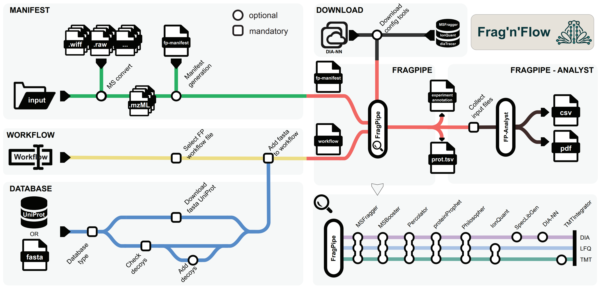

# FragFlow
**Automated Workflow for Large-Scale Quantitative Proteomics in High Performance Computing Environments**

### **Table of contents**
>[Introduction](#introduction)

>[Workflow](#workflow)

>[Installation](#installation)
>> [Prerequisite: Nextflow](#prerequisite-nextflow)

>[Running FragFlow](#fragflow-analysis)
>> [1. Preparing input files](#1-preparing-input-files)\
>> [2. Configuration](#2-configuration)\
>> [3. Starting FragFlow](#3-running-fragflow)\
>> [4. Config Tools Download](#4-config-tools-download)\
>> [5. Notes on DIA-NN version](#5-notes-on-dia-nn-version)\
>> [6. Outputs](#outputs)

>[Parameters](#parameters)

>[Individual sub-workflows](#individual-sub-workflows)
>>[MSConverter](#msconverter)\
>>[FragPipe](#fragpipe)\
>>[FragPipe-Analyst](#fragpipe-analyst)

>[References](#references)

>[Authors](#authors)

### Introduction
lorem ipsum

### Workflow and overview
TODO: mi a fő lényeg\
bullet pointok\
This workflow will do the following:
- manifest ....
- workflow
- "The pipeline also contains .... DATABASE..."
- gradually tömd a libát!


**Figure 1. - Overview of FragFlow.** The workflow is composed of five sub-workflows: **manifest** file generation part creates the first input file based on a specified folder, with an optional MS raw file conversion step; **database** module downloads the reference proteome and augments them with decoy sequences; a **workflow** module which defines the desired analysis mode provided by FP; **FragPipe** module performs the actual MS analysis; **FragPipe-Analyst** module conducts the downstream post-processing analysis. Our workflow supports all predefined FragPipe analysis modes (FragPipe workflows) as well as custom user-defined configurations.

-----

## Installation
### Prerequisite: Nextflow
The only requirement is the installation of Nextflow, which can be easily performed using their self-installing package. **(All other requrisrements are already pre-packed into Docker containers!...)** For detailed instructions, refer to the official [Nextflow Installation Guide](https://www.nextflow.io/docs/latest/install.html).
To install Nextflow simpy run:
``` 
curl -s https://get.nextflow.io | bash
```
Move nextflow into an executable folder and add to ```PATH```:
```
mkdir -p $HOME/.local/bin/
mv nextflow $HOME/.local/bin/

export PATH="PATH:$HOME/.local/bin"
```
Then, verify the installation:
```
nextflow -version
```

## Runnning/Using FragFlow
### 1. Preparing input files
By default ```.raw``` and ```.mzML``` mass spectrometry files are supported. Other file types may also be used - please refer to the [MSConverter sub-workflow](#msconverter) for compatibility details.\
**File naming convention:**
Input files should follow FragPipe's manifest generation guidelines. Please prepare the input files using the format: 
```
<filename>_<experiment>_<bioreplicate>_<mode>.raw
```
- filename - Original aw MS file name
- experiment - Group, experiment, or treatment identifier of the sample (can be text, number, or left empty)
- bioreplicate - Numerical identifier of a sample (can be number, or left empty)
- mode - Aqcuisition mode used in FragPipe (options: DDA, DDA+, DIA, DIA-Quant, or DIA-lib)

**Examples filenames:** 
- ```filename_control_1_DDA.mzML```
- ```filename_KO_3.raw```
- ```filename_treatment_DIA.raw```
- ```filename_control.mzML```

Ensure that your input files are named correctly to prevent processing errors.

### 2. Configuration
Input parameters can be defined in multiple ways:
- **A. Modifying the ```nextflow.config``` file**
    - Recommended only when pulling this repository.
    - Allows setting default configurations for the workflow.
- **B. Using custom config file (```<your_file>.<yml/json>```)**
    - Definie parameters in ```YAML``` or ```JSON``` format.
    - Specify the config file when running Nextflow:
    - Refer to Nextflow's documentation on [parameter files](https://www.nextflow.io/docs/latest/cli.html#pipeline-parameters)
```
nextflow run sznistvan/nf-fphpc -params-file my_parameters.yml
```
- **C. Defining parameters in the command line**
    - Recommended for quick and flexible excecution
    - Example command:
```
nextflow run sznistvan/nf-fphpc \
    --input_folder "/path/to/input/folder" \
    --ram 32 \
    --threads 16 \
    --workflow "LFQ-MBR" \
    --mode "DDA" \
    --fasta_file "UP000005640"
```
**Further details please check Nextflow's documentation on hierarchy parameter settings... LINK**
**Mandatory parameters:**
To successfully execute FragFlow, the following parameters must be specified:
- ```--input_folder``` - Path to the input folder
- ```--workflow``` - Selected workflow
- ```--mode``` - Aqcuisition mode
- ```--fasta_file```. Reference proteome *fasta* file

For more details see the [Parameters](#parameters) section

### 3. Running FragFlow
When runnning FragFlow, all output files will be generated into the current working directory. If executing multiple analysis, **ensure that you are in the correct directory before starting the workflow!**\
\
**Basic execution**
``` 
nextflow run sznistvan/nf-fphpc
```
**Running as a background process**\
For long-runnning analysis, it is recommended to start FragFlow as a background process. This allows uninterrupted execution even if the terminal session is closed (similar to *nohup*). To do so, use the ```-bg``` option and redircet the ouptut to a log file:
```
nextflow run sznistvan/nf-fphpc -bg > fragflow.log
```
This ensures that the process continues running while logs are stored in fragflow.log for monitoring.

To cancel FragFlow, first identify the process pid using ```ps``` or alternatively check the ```.nextflow.pid``` to ```kill``` the process. More information on [background execution](https://www.nextflow.io/docs/latest/cli.html#execution-as-a-background-job).
### 4. Downloading licensed FragPipe components (config tools)
TODO: 3 components need academic licensing aggreement to work with\
To enable user-friendly execution, the download process of config tools (MSFragger, diaTracer, and IonQuant) tools are also automated. For the initial analysis, all config tools will be downloaded keeping all necessary licensing directives nice. 

### 5. Notes on DIA-NN version
Currently FragPipe supports DIA-NN version 1.8.2beta. With FragFlow, (no need:similarly to the GUI version of FP), users can add custom versions of DIA-NN to use. https://github.com/vdemichev/DiaNN/releases/latest
Define the download link to the *Linux* version of any DIA-NN release using the ```--diann_download``` parameter.\
*Note: currently when using MSBooster, the newer versions of DIA-NN does not run successfully. For this reason, when specifying newer version of DIA-NN (1.8.2+), the newer version will only be used during the DIA-NN analysis. Additionally, current changes in newer DIA-NN modules, can raise errors in FP, which will be eventually handled by FP developers in future releases. This does not effect the results generated by FragFlow.*

### 6. Outputs
TODO: describe the output formats, the log files for each and every process in the work/XX/hexa/nextflow.log file!...

-----

## Parameters
Parameters are accesible through the *nextflow.config* file. Additionally, every parameter can be added during execution e.g. *--input_folder*.
**Mandatory parameters:**
|Parameters|Types|Description|
|-----------------|-----|-----------|
|```--input_folder```|*string*|Folder containing the input files with the specified name conventions LINK|
|```--mode```|*string*|Data aqcuisition mode (DDA, DIA, TMT)|
|```--workflow```|*string*|Name of one of the pre-defined [workflow available in FragPipe](https://fragpipe.nesvilab.org/docs/tutorial_fragpipe_workflows.html)|
|```--fasta_file```|*string*|Path to fasta_file location OR UniProt ID of reference proteome.|

**MSConverter parameters:**
Parameter|Types|Description|
|---------|-----|-----------|
|```--raw_file_type```|*string*|Extension of raw files used. *Default: .raw*|
|```--batch_size```|*integer*|Number of files handled by MSConverter in one job. Use this parameter to set the number of jobs started for raw file conversion. E.g. Batches of 10 for 100 files will start 10 parallel jobs.|

**Optional FragPipe parameters:**
|Parameter|Types|Description|
|---------|-----|-----------|
|```--decoy_tag```|*string*|The tag identifier used in the fasta file for decoy sequences. Default: *'rev_'*|
|```--db_split```|*integer*|DB split ...|
|```--ram```|*integer*|Memory allocation for FragPipe [GB]|
|```--threads```|*integer*|Number of threads defined for FragPiipe|

**Sub-workflow switch parameters:**
|Parameter|Types|Description|
|---------|-----|-----------|
|```--disable_msconvert```|*boolean*|Turn on-off the sub-workflow MSConverter|
|```--disable_fragpipe```|*boolean*|Turn on-off the sub-workflow FragPipe|
|```--disable_fp_analyst```|*boolean*|Turn on-off the sub-workflow FragPipe-Analyst|

**Config tools parameters:**
|Parameter|Types|Description|
|---------|-----|-----------|
|```--config_tools_update```|*boolean*|Force download of all config tools.|
|```--diann_download```|*string*|Url link to DIA-NN release (If blank ```''```, then built-in DIA-NN will be used)|

**FragPipe-Analyst parameters:**
|Parameter|Types|Description|
|---------|-----|-----------|
|```--experiment```|*string*|Path to ```experiment_annotation.tsv``` file used by FragPipe-Analyst.|
|```--p_table```|*string*|Path to prtoein/peptide table used by FragPipe-Analyst.|
|```--analyst_mode```|*string*|Analysis mode of FragPipe-Analyst. Available modes: "protein" OR "peptide".|
|```--gene_list```|*string list*|List of strings containing gene/protein names, used for the boxplot generation for comparisions.|
|```--plot_mode```|*string*|Vizualization mode used in FragPipe-Analyst, for the volcano plots and comparative boxplots. Available modes: "gene" OR "protein"|

-----

## Detaild description of individual sub-workflows
### MSConverter
adas
### FragPipe
run only fragpipe

### FragPipe-Analyst
run only fragpipe anal

## References
- FragPipe
- FragPipe-Analyst
- Ionquant, MSFragger, diaTracer\
MSFragger: ultrafast and comprehensive peptide identification in mass spectrometry-based proteomics. Nat Methods 14:513 (2017)
- DIA-NN\
Demichev et al, Nature Methods, 2020, https://www.nature.com/articles/s41592-019-0638-x

## Authors
<ins>Istvan Szepesi-Nagy</ins>(1,6), Roberta Borosta(1,7), Zoltan Szabo(2), Gabor Tusnady(3), Lorinc Pongor(4), Gergely Rona(1,5)

1. DNA Repair Research Group, Institute of Molecular Life Sciences, HUN-REN Research Centre for Natural Sciences, Budapest, HU
2. Department of Medical Chemistry, Albert Szent-Györgyi Medical School, University of Szeged, Szeged, HU
3. Proteomics Bioinformatics Research Group, Institute of Molecular Life Sciences, HUN-REN Research Centre for Natural Sciences, Budapest, HU
4. Cancer Genomics and Epigenetics Core Group, Hungarian Centre of Excellence for Molecular Medicine (HCEMM), Szeged, HU
5. Department of Biochemistry and Molecular Pharmacology, NYU Grossman School of Medicine, NY, USA
6. Semmelweis University Doctoral School, Budapest, HU
7. Doctoral School of Biology, ELTE Eötvös Loránd University, Budapest, HU
